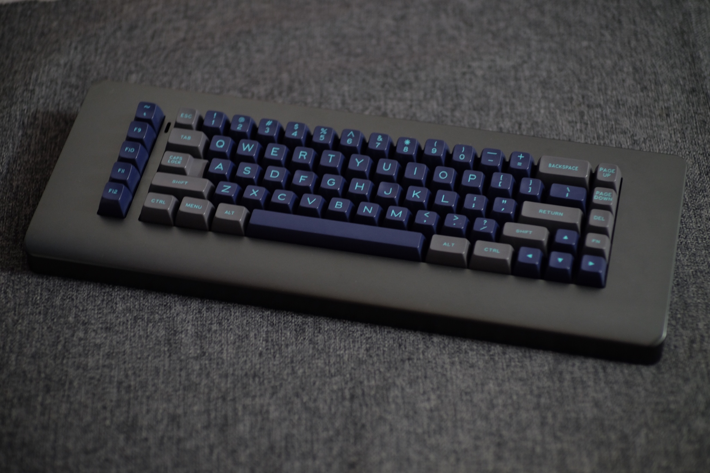
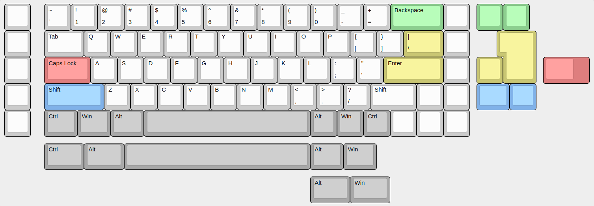

# Mammoth PCB

This is a replacement PCB for the chunkiest, juiciest and most 
elegant keyboard on the internet, the one and only Elephant.

## Specifications

* USB Mini-B port

### Supported Layouts

## Group Buys

This Keyboard had two production rounds on GeekHack:

* [Round 1](https://geekhack.org/index.php?topic=96434.0)
* [Round 2](https://geekhack.org/index.php?topic=103148.0)
